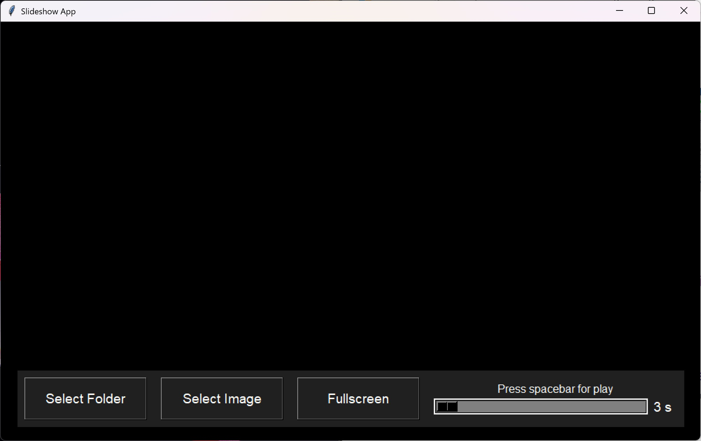

<h1 align="center">SlideShow</h1>

###

<h3 align="center">A simple slideshow program.</h3>

###

  

###

If, like me, you're looking for a super simple program to load your images and make them slide, then you're in the right place.  What can I say about myself? Well, I've never programmed before. I have ZERO experience in this field. Despite that, I've always worked in IT, I love it, and I've been passionate about it since my first IBM 5150.  Tired of using Windows' built-in slideshow, which lets you add music, transitions, and more (but not a timer to set the speed), I went looking for a simple program. Maybe I didn’t search well enough, but I couldn't find one that fit my basic needs. So, I took the plunge, opened GitHub Copilot, chose a language that seemed the simplest (Python), and put together this "program" that looks like it came straight from the '80s... but hey, it works! It can read *.png, *.jpg, *.jpeg, *.gif, *.bmp.  The functionality is simple.  Click "Select Folder" if you want to choose a folder containing all the desired images. Click "Select Image" if you want to pick only specific images from a folder. Move the slider to set the time between images (min 3 sec, max 30 sec) and press the spacebar. That's it.  If you want to switch to Fullscreen mode, just click the dedicated button, and press Esc to exit.  You can also navigate forward and backward through the images using the arrow keys.  That's all. 

###
